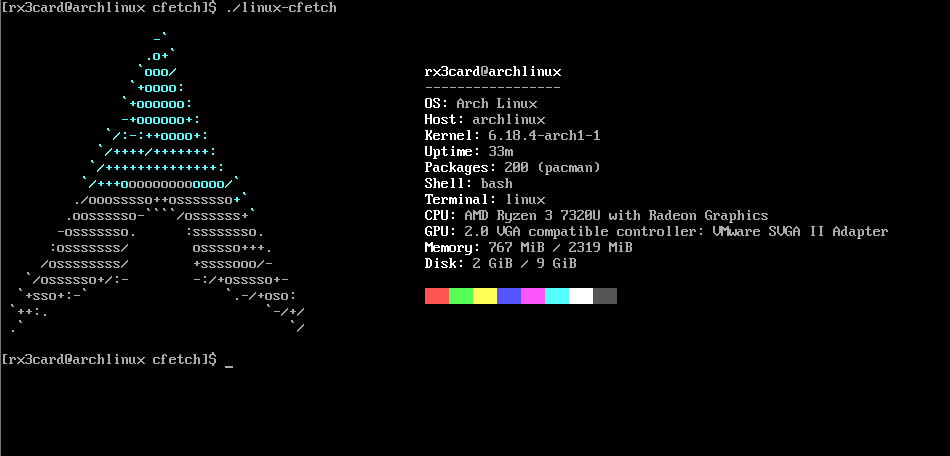

# CFetch

A lightweight alternative to neofetch written in pure C. Fast, minimal, and dependency-free.

> **Note**  
> [Read in Spanish](README_es.md)

## Why CFetch?

Tired of waiting for neofetch to load? So was I. CFetch gives you the same system information in just 3ms compared to neofetch's 220ms. It's not magic, just efficient code without the bloat.

## Evidence (Screenshots)

  
*CFetch showing detailed information on Windows*

  
*CFetch on Arch Linux*

**NOTE:** CFetch currently supports the most common operating systems:  
- Windows  
- Linux:  
  - Arch Linux  
  - Ubuntu  
  - Debian  
  - And more (shows generic Linux logo for others)

## Installation

### Linux & macOS

**NOTE:** For this to work successfully you need a compiler, preferably gcc.

Open a terminal and run this command:

```bash
curl -sSL https://raw.githubusercontent.com/rx3card/cfetch/main/install-cfetch.sh | bash
```

Or if you prefer to download the script first:

```bash
# Download the script
curl -O https://raw.githubusercontent.com/rx3card/cfetch/main/install-cfetch.sh

# Make it executable
chmod +x install-cfetch.sh

# Run it (you'll need admin password)
./install-cfetch.sh
```

### Installation without requirements

Open your terminal and run the following commands:

```bash
cd CFech-multiplaform/
chmod +x install.sh
sudo ./install.sh
```

This is not yet functional. Keep this in mind: if this option doesn't work for installing cfetch on Windows, you'll most likely need to use the previous installation method.

## Windows

1. Download the installer from [the latest release](https://github.com/rx3card/cfetch/releases)  
2. Run the downloaded file  
3. Follow the on-screen instructions  
4. Open a new terminal and type `cfetch`

## Why CFetch?

Because sometimes you just want something that works without complications:  
- **Lightning fast** — Pure C compiled, no loading times  
- **Zero dependencies** — No need to install Python or anything weird  
- **For everyone** — Works just as well on Windows, Linux and Mac  
- **Looks good out of the box** — No configuration needed

## How to use

```bash
cfetch          # Shows system info
cfetch --help   # Shows help
```

## System Requirements

- **Windows**: 7 or higher (32 or 64 bits)  
- **Linux**: Any modern distribution  
- **macOS**: 10.13 or higher  
- **Disk space**: Less than 1MB

## Basic Usage

Once installed, simply run:

```bash
cfetch
```

### Available options:

```bash
cfetch               # Shows system information
cfetch --help        # Shows help
cfetch --version     # Shows version
cfetch --no-color    # Disables colors
cfetch --simple      # Shows only basic information
```

### Compilation

#### Requirements:
- **Windows**: MinGW or Visual Studio, Inno Setup  
- **Linux/macOS**: gcc/clang and make

## 🛠️ Quick Developer Guide

### Useful Commands

```bash
# Compile on Windows
.\build_simple.ps1

# Create installer (requires Inno Setup)
.\build_installer.ps1
```

### How to Contribute

1. Fork the repository  
2. Create a branch for your feature: `git checkout -b my-new-feature`  
3. Commit your changes: `git commit -am 'Add some feature'`  
4. Push to the branch: `git push origin my-new-feature`  
5. Open a Pull Request

## 🚀 Usage

### Basic Command

```bash
cfetch
```

### Options

```bash
cfetch                # Shows system information
cfetch --help         # Shows help
cfetch --version      # Shows version
cfetch --no-color     # Disables colors
cfetch --simple       # Simple mode (less information)
cfetch --default-logo # Shows my default logo
```

## 👏 Acknowledgments

- Inspired by [neofetch](https://github.com/dylanaraps/neofetch)  
- To all the [contributors](https://github.com/rx3card/cfetch/graphs/contributors)

## ⭐ Like CFetch?

Give it a star on [GitHub](https://github.com/rx3card/cfetch) to support the project! ⭐

## 📬 Contact

Questions? Suggestions? Open an [issue](https://github.com/rx3card/cfetch/issues) or send me a message!

---

💡 **Tip:** Press `F5` in the terminal after installing to refresh the PATH.

## 🤝 Contribute

1. Fork the project  
2. Create a branch for your feature (`git checkout -b feature/new-feature`)  
3. Commit your changes (`git commit -am 'Add new feature'`)  
4. Push to the branch (`git push origin feature/new-feature`)  
5. Open a Pull Request
