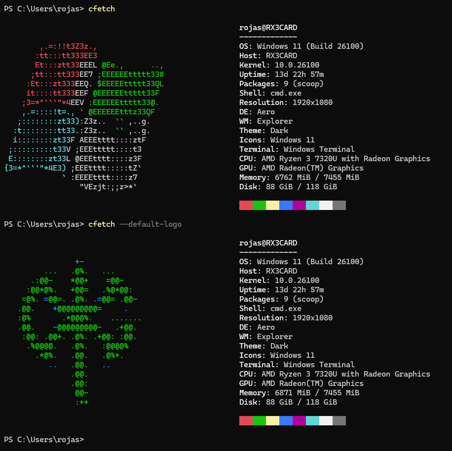

# CFetch

A lightweight alternative to neofetch written in pure C. Fast, minimal, and dependency-free.

> **Note**
> [Leer en español](README_es.md)

## Why CFetch?

Tired of waiting for neofetch to load? So was I. CFetch gives you the same system information in just 3ms compared to neofetch's 220ms. It's not magic, just efficient code without the bloat.


## Envidencias (Capturas)


*CFetch mostrando información detallada en Windows*

<!--  -->
<!-- *CFetch en una terminal de Linux personalizada* -->


**NOTE:** CFetch currently supports the most common operating systems:
- Windows
- Linux:
  - Arch Linux
  - Ubuntu
  - Debian
  - And more (shows generic Linux logo for others)

## Installation

### Linux & macOS

**NOTA:** Para que esto sea exitoso es necesario que tengas un compilador, preferiblemente gcc.

Abre una terminal y ejecuta este comando:

```bash
curl -sSL https://raw.githubusercontent.com/rx3card/cfetch/main/install-cfetch.sh | bash
```

O si prefieres descargar primero el script:

```bash
# Descargar el script
curl -O https://raw.githubusercontent.com/rx3card/cfetch/main/install-cfetch.sh

# Hacerlo ejecutable
chmod +x install-cfetch.sh

# Ejecutar (necesitarás contraseña de administrador)
./install-cfetch.sh
```

### Instalación sin requerimientos

Abre tu terminal y ejecuta los siguientes comandos:

```bash
cd CFech-multiplaform/
chmod +x install.sh
sudo ./install.sh
```

Esto aun no es funcional. Ten lo encuenta de modo que para instalar cfetch en windows si esta opción no funciona posiblemente tengas que realizar la instalacion anterior.

## Windows

1. Descarga el instalador de [la última versión](https://github.com/rx3card/cfetch/releases)
2. Ejecuta el archivo descargado
3. Sigue las instrucciones en pantalla
4. Abre una nueva terminal y escribe `cfetch`


## ¿Por qué CFetch?

Porque a veces solo quieres algo que funcione sin complicaciones:
- **Rápido como el rayo** - Compilado en C puro, sin tiempos de carga
- **Sin dependencias** - No necesitas instalar Python ni nada raro
- **Para todos** - Funciona igual de bien en Windows, Linux y Mac
- **Bonito por defecto** - Sin necesidad de configurar nada

## Cómo se usa

```
cfetch          # Muestra la info del sistema
cfetch --help   # Muestra la ayuda
```

## Requisitos del Sistema

- **Windows**: 7 o superior (32 o 64 bits)
- **Linux**: Cualquier distribución moderna
- **macOS**: 10.13 o superior
- **Espacio en disco**: Menos de 1MB

## Uso Básico

Una vez instalado, simplemente ejecuta:

```bash
cfetch
```

### Opciones disponibles:

```
cfetch               # Muestra la información del sistema
cfetch --help        # Muestra la ayuda
cfetch --version     # Muestra la versión
cfetch --no-color    # Desactiva los colores
cfetch --simple      # Muestra solo la información básica
```

### Compilación
#### Requisitos:
- **Windows**: MinGW o Visual Studio, Inno Setup
- **Linux/macOS**: gcc/clang y make


## 🛠️ Guía Rápida para Desarrolladores

### Comandos Útiles

```bash
# Compilar en Windows
.\build_simple.ps1

# Crear instalador (requiere Inno Setup)
.\build_installer.ps1
```

### Cómo Contribuir

1. Haz un fork del repositorio
2. Crea una rama para tu función: `git checkout -b mi-nueva-funcion`
3. Haz commit de tus cambios: `git commit -am 'Añade alguna función'`
4. Haz push a la rama: `git push origin mi-nueva-funcion`
5. Abre un Pull Request

## 🚀 Uso

### Comando Básico
```bash
cfetch
```

### Opciones
```
cfetch                # Muestra la información del sistema
cfetch --help         # Muestra la ayuda
cfetch --version      # Muestra la versión
cfetch --no-color     # Desactiva los colores
cfetch --simple       # Modo simple (menos información)
cfetch --default-logo # Muestra logo predeterminado por mi
```

## 👏 Reconocimientos

- Inspirado en [neofetch](https://github.com/dylanaraps/neofetch)
- A todos los [contribuyentes](https://github.com/rx3card/cfetch/graphs/contributors)

## ⭐ ¿Te gusta CFetch?

¡Dale una estrella en [GitHub](https://github.com/rx3card/cfetch) para apoyar el proyecto! ⭐

## 📬 Contacto

¿Preguntas? ¿Sugerencias? ¡Abre un [issue](https://github.com/rx3card/cfetch/issues) o envíame un mensaje!

---

💡 **Consejo:** Presiona `F5` en la terminal después de instalar para actualizar el PATH.


## 🤝 Contribuir

1. Haz un fork del proyecto
2. Crea una rama para tu característica (`git checkout -b feature/nueva-funcion`)
3. Haz commit de tus cambios (`git commit -am 'Añade nueva función'`)
4. Haz push a la rama (`git push origin feature/nueva-funcion`)
5. Abre un Pull Request